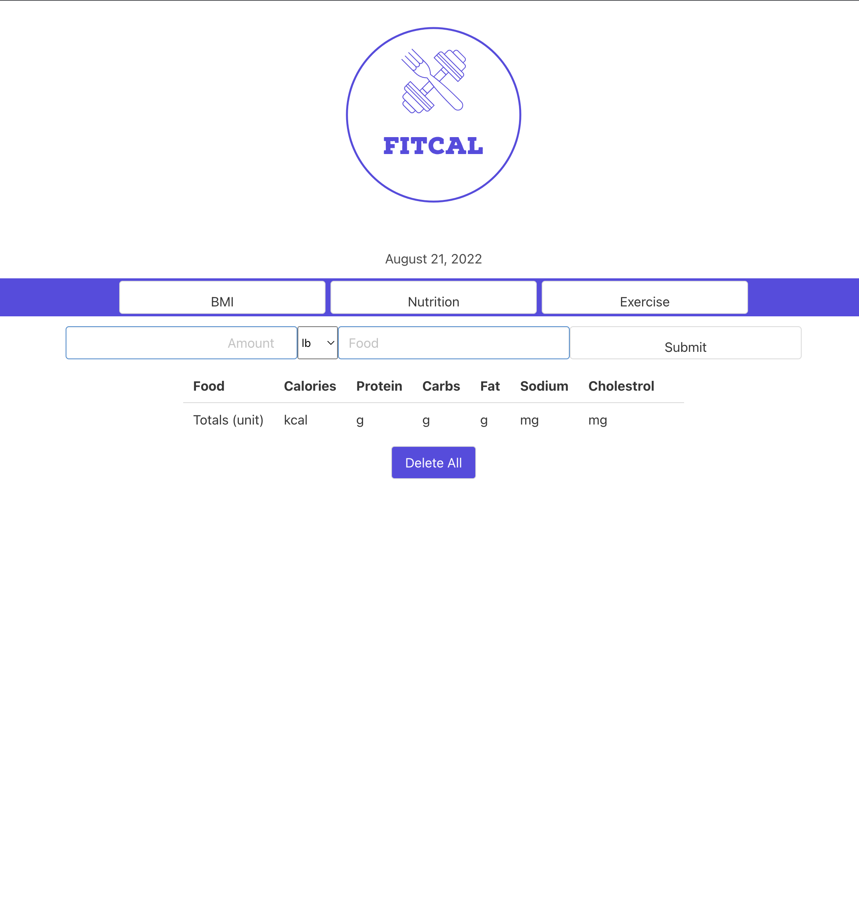

# Group Project FitCal - Nutrition and Exercise App 

## Description

FitCal is a nutrition and exercise app with a simple and clean inteface to assist user with daily logs of nutritional values, BMI index and exercise routine.  
 
User can enter food and amount to look up its nutritional values from the nutritional database.  
User can check their BMI index upon clicking on the BMI button and enter his/her weight in lbs and hight in inches.  
User can create an exercise daily routine by clicking on the Exercise button and go through the menu of exercises based on user's choice of intensity, type and body area. 

## Technologies used
Bulma, Jquery, Moment.js, Nutrition API, Exercise API.

## Contributors
Domingues, Robert  
Gomez, Christopher  
Sitnitski, Stan  
Yoon, Gi Won  
Chavez, Juan 

## Usage

User can find deployed app at [FitCal](https://robdom87.github.io/FitCal/)

Repo for app can be found at: (https://github.com/Robdom87/FitCal)
